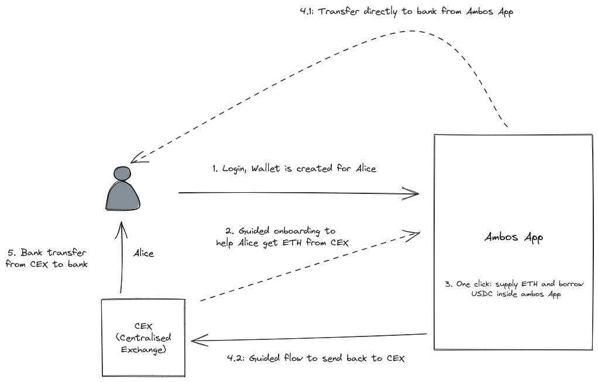

# ✨ Why Ambos?

Probably the easiest way to explain the value of Ambos is to compare the borrowing process with and without our application.  In this article, we compare the flow for an imaginary user taking out a DeFi loan, with and without the Ambos application.

**Scenario:** Alice decided to invest into crypto in 2021. She holds most of her assets in a Centralised Exchange (CEX) such as Binance or Coinbase, and hasn't really used anything else. She wants to go on holiday this summer and is tired of waiting for crypto prices to rebound. She decides to take out a $5000 loan using Ambos.&#x20;

## Option 1: Alice tries DeFi

Below are the steps Alice must take if she wanted to take out a loan without Ambos:

**Step 1:** Setup an Ethereum Wallet - Alice must download Metamask or some other wallet, and securely save her new seed phrase.

**Step 2:** Send her ETH from the Centralised Exchange (CEX) to an Ethereum Wallet.

**Step 3:** Decide on a network to use. Ethereum is expensive, and network fees can total hundreds of dollars. Alice could instead use on of the Ethereum "Layer 2s", which offer significantly cheaper fees. She will need to decide which of these networks to use.&#x20;

Alice then "Bridges" her ETH from her Ethereum Wallet on the Ethereum main network, to the cheaper, layer 2 network.

**Step 4:** Choose a DeFi lending protocol, or use a DeFi product such as InstaDapp or DeFiSaver. These are all fantastic apps, but there are a lot of options for lending and borrowing assets on all these apps, so Alice must take the time to carefully understand what she wants to lend, borrow and the terms. In our example, Alice chooses Aave and Supplies ETH as collateral to the Aave Pool.

**Step 5:** Borrow 5000 USDC or another stablecoin.

**Step 6:** Send the funds back to her CEX of choice, in order to start a bank transfer.

**Step 7:** Initiate the bank transfer and wait.

You can see the below in a simple flow diagram. This all assumes Alice is comfortable keeping her private keys or seed phrase secure, and is happy to research and navigate the significant complexity of the different DeFi apps, wallets, lending protocols and infrastructure.&#x20;

She will also need to pay network fees, and wait for transactions to process. For someone new to all this, a process like this could take weeks, and a single wrong transaction could be extremely costly.

<figure><figcaption></figcaption></figure>

<figure><figcaption>
Click to expand
</figcaption></figure>

## Option 2: Ambos

The core problem Ambos is aiming to solve is to make it easy for users like Alice who have a simple requirement: "I want money to spend in the real world, but I would like to keep hold of my crypto". By focusing on this workflow, and only this workflow, we can really simplify the process for users like Alice.&#x20;

**Step 1:** Alice logs into the Ambos app with her Google Account, Apple ID or an email. Behind the scenes, an Ethereum wallet is created for her.

**Step 2:** Alice sends ETH to the Ambos wallet from her CEX. We have a guided process to check if Alice has ETH on a cheaper network, and help users with the bridging process. She is also able to buy ETH directly in the Ambos app if she prefers.

**Step 3:** In one click, she can deposit her ETH, and borrow $5000 in USDC, a stablecoin. Ambos takes care of all the internal transactions.

**Step 4 - Option 1:** If Alice is using a supported bank and currency, she can convert her USDC to a fiat currency of her choice directly from the Ambos app.&#x20;

**Step 4 - Option 2:** If Alice is using an unsupported bank or currency, Ambos guides her through sending her funds back to her CEX of choice. Alice must initiate the bank transfer process from her CEX, exactly as above.

The flow diagram for Ambos is below. While there are a few steps, there are some major advantages for someone like Alice:

1. Alice is not having to manage her blockchain credentials directly. She accesses her Ethereum wallet securely through accounts she already uses on a daily basis.
2. Alice does not have to jump through several different applications and processes: everything is done either the Ambos app or in her Centralised Exchange.
3. Ambos sets up sensible defaults that are suitable for most users in Alice's situation when taking out the loan, this reduces the complexity and number of decisions Alice must take. Importantly, we don't try and cater to more advanced users, so it really lets us focus on keeping the whole process as smooth and streamlined as possible for Alice.

As in the above case, there will still be some costs Alice will have to pay. These are network charges and any CEX fees, plus a 1% deposit fee that Ambos charges. On the other hand, Ambos is able to offer savings to Alice by reducing the number of transactions she needs to do.

<figure><figcaption></figcaption></figure>

<figure><figcaption></figcaption></figure>
